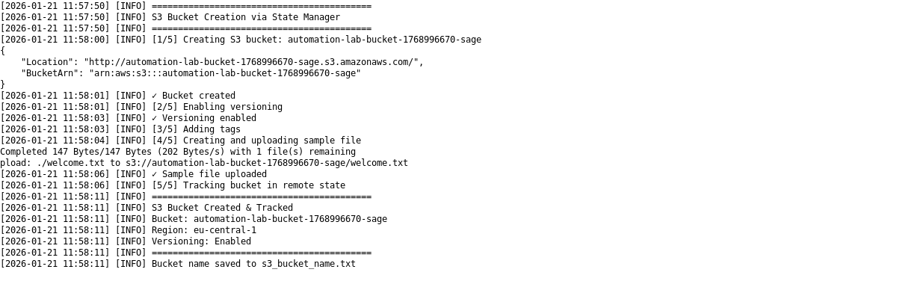
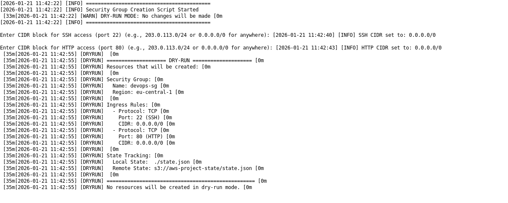
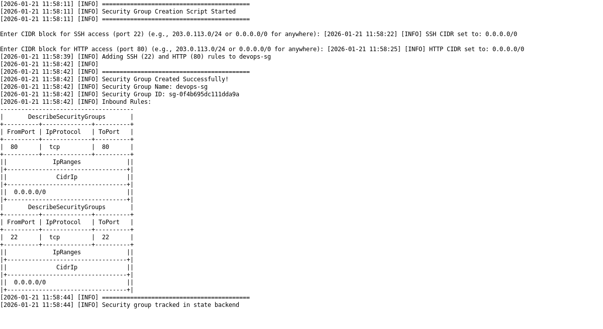

# AWS Resource Automation with Bash

A comprehensive Bash-based automation framework for provisioning and managing AWS resources (EC2, S3, Security Groups) with state management and logging capabilities.

## Project Overview

This project provides production-ready scripts to automate AWS resource creation, configuration, and cleanup. All resources are tracked in a remote S3-based state file, enabling infrastructure-as-code practices and preventing drift.

## Scripts

### 1. **create_ec2.sh**
**Purpose**: Automate EC2 instance creation with security group and key pair management.

**Features**:
- Dynamic AMI resolution (latest Amazon Linux 2)
- Automatic security group creation with SSH access configuration
- Key pair generation and management
- State tracking of all resources
- Dry-run mode with detailed resource preview
- SSH CIDR block customization via environment variable or interactive prompt

**Usage**:
```bash
# Interactive mode (prompts for SSH CIDR)
./create_ec2.sh

# With environment variable (skip prompt)
SSH_CIDR="203.0.113.0/24" ./create_ec2.sh

# Dry-run mode
./create_ec2.sh --dry-run

# Customize instance type and region
INSTANCE_TYPE="t3.small" AWS_REGION="us-west-2" ./create_ec2.sh
```

**Output**: Instance ID, public/private IPs, SSH command, and key pair name.

---

### 2. **create_s3_bucket.sh**
**Purpose**: Create and configure S3 buckets with versioning and tagging.

**Features**:
- Automatic unique bucket naming with timestamp and username
- Versioning enabled by default
- Automatic tagging (Project: AutomationLab, Environment: Development)
- Sample welcome file upload
- State tracking
- Dry-run mode

**Usage**:
```bash
# Create S3 bucket
./create_s3_bucket.sh

# Dry-run mode
./create_s3_bucket.sh --dry-run

# Custom region
AWS_REGION="eu-west-1" ./create_s3_bucket.sh
```

**Output**: Bucket name saved to `s3_bucket_name.txt`, tracked in state.

---

### 3. **create_security_group.sh**
**Purpose**: Create and configure security groups with custom ingress rules.

**Features**:
- Create named security groups
- Configure SSH (port 22) and HTTP (port 80) with custom CIDR ranges
- Interactive CIDR prompts with format examples
- State tracking
- Dry-run mode with rule preview

**Usage**:
```bash
# Interactive mode (prompts for SSH and HTTP CIDR)
./create_security_group.sh

# With environment variables (skip prompts)
SSH_CIDR="10.0.0.0/8" HTTP_CIDR="0.0.0.0/0" ./create_security_group.sh

# Dry-run mode
./create_security_group.sh --dry-run
```

**CIDR Examples**:
- `0.0.0.0/0` - Allow from anywhere (not recommended for SSH)
- `203.0.113.0/24` - Allow from specific subnet
- `203.0.113.50/32` - Allow from single IP

---

### 4. **cleanup_resources.sh**
**Purpose**: Safely delete all AWS resources tracked in state.

**Features**:
- Displays detailed resource information before deletion
- Interactive confirmation prompt
- Handles EC2 termination with wait logic
- Properly handles versioned S3 buckets
- Graceful error handling (idempotent - safe to run multiple times)
- Dry-run mode to preview deletion

**Usage**:
```bash
# Dry-run mode (preview what will be deleted)
./cleanup_resources.sh --dry-run

# Delete all resources (requires confirmation)
./cleanup_resources.sh
```

**Deletion Order**:
1. EC2 instances (with wait for full termination)
2. Key pairs
3. Security groups (after EC2 termination)
4. S3 buckets (including all versioned objects)

---

### 5. **logger.sh**
**Purpose**: Centralized logging utility used by all scripts.

**Features**:
- Color-coded log levels (DEBUG, DRYRUN, INFO, WARN, ERROR)
- Console and file output
- Configurable log levels

**Log Levels**:
- `DEBUG` (blue) - Detailed debug information
- `DRYRUN` (magenta) - Dry-run mode messages
- `INFO` (white) - General information
- `WARN` (yellow) - Warnings
- `ERROR` (red) - Errors

**Usage**:
```bash
source ./logger.sh

log_info "Creating resource..."
log_warn "This is a warning"
log_error "An error occurred"
log_dryrun "Dry-run preview"
```

---

### 6. **state/state_manager.sh**
**Purpose**: Manage remote state storage in S3 and local state synchronization.

**Features**:
- S3-based state backend (automatic bucket creation)
- Local state file synchronization (`./state.json`)
- CRUD operations for resource tracking
- Automatic state push/pull
- Helper functions for resource management

**State Structure**:
```json
{
  "project": "aws-project",
  "region": "eu-central-1",
  "resources": {
    "ec2": { "instance-id": {...} },
    "security_group": { "sg-id": {...} },
    "keypair": { "key-name": {...} },
    "s3": { "bucket-name": {...} }
  }
}
```

---

## Setup and Execution

### Prerequisites

1. **AWS CLI** - Installed and configured with credentials
   ```bash
   aws --version
   aws sts get-caller-identity  # Verify credentials
   ```

2. **jq** - JSON query tool
   ```bash
   sudo apt-get install jq  # Ubuntu/Debian
   brew install jq          # macOS
   ```

3. **Bash 4.0+**
   ```bash
   bash --version
   ```

### Initial Setup

1. **Clone the repository**:
   ```bash
   git clone <repository-url>
   cd Automate_AWS_Resource_Creation_with_Bash
   ```

2. **Set executable permissions**:
   ```bash
   chmod +x *.sh state/*.sh
   ```

3. **Configure AWS credentials** (if not already done):
   ```bash
   aws configure
   ```

4. **Optional: Set environment variables**:
   ```bash
   export AWS_REGION="eu-central-1"
   export STATE_BUCKET="my-custom-state-bucket"
   export LOG_LEVEL="INFO"
   ```

### Typical Workflow

```bash
# 1. Create a security group with custom rules
./create_security_group.sh

# 2. Create an EC2 instance
./create_ec2.sh

# 3. Create an S3 bucket
./create_s3_bucket.sh

# 4. View state
cat state.json

# 5. Test cleanup with dry-run
./cleanup_resources.sh --dry-run

# 6. Clean up all resources
./cleanup_resources.sh
```

---

**Screenshots**

- **Create EC2 — Dry-run:** 
  - **Create EC2 — Real:** 

- **Create S3 Bucket — Dry-run:** 
  - **Create S3 Bucket — Real:** 

- **Create Security Group — Dry-run:** 
  - **Create Security Group — Real:** 

- **Cleanup Resources — Dry-run:** 
  - **Cleanup Resources — Real:** 

Run the capture and image-generation helpers to produce these files locally:

```bash
./capture_outputs.sh      # dry-run mode creates *_dryrun.txt outputs
./capture_outputs.sh real # real mode (prompts; creates *_real.txt outputs)
./generate_images.sh      # converts .txt outputs to PNG images in screenshots/
```


## Challenges Faced & Resolutions

### Challenge 1: AWS CLI Output Interference
**Problem**: AWS CLI commands were outputting JSON to stdout, causing jq parsing errors and state file corruption.

**Resolution**: Added proper output redirection (`>/dev/null 2>&1`) to all AWS CLI commands to suppress both stdout and stderr. This ensures clean state file creation and manipulation.

### Challenge 2: State File Path Accessibility
**Problem**: Initial `/tmp/state.json` path was not accessible in the WSL environment, causing "No such file or directory" errors.

**Resolution**: Changed state file location to `./state.json` (current working directory) for better accessibility and portability across environments.

### Challenge 3: jq Variable Escaping in State Deletion
**Problem**: Resource IDs like `i-0d0e34163e1cfdccb` were causing jq syntax errors when used directly in filter strings due to lack of proper escaping.

**Original Code**:
```bash
jq "del(.resources[$resource][$id])" "$STATE_LOCAL"
```

**Resolution**: Used jq's `--arg` flags for proper variable substitution:
```bash
jq --arg r "$resource" --arg id "$id" 'del(.resources[$r][$id])' "$STATE_LOCAL"
```

### Challenge 4: EC2 SSH Access Issues
**Problem**: Created EC2 instances had no SSH ingress rules, making them inaccessible.

**Resolution**: 
- Added automatic SSH rule creation via `authorize-security-group-ingress`
- Made CIDR block customizable via environment variable or interactive prompt
- Provided format examples for flexibility

### Challenge 5: Security Group Deletion Dependencies
**Problem**: Security group deletion failed because EC2 instances were still shutting down and ENIs (network interfaces) were still attached.

**Resolution**: Added `aws ec2 wait instance-terminated` after EC2 termination to ensure full cleanup before attempting security group deletion.

### Challenge 6: Idempotency in Cleanup
**Problem**: Running cleanup multiple times would fail on already-deleted resources, corrupting state if deletion succeeded but state update failed.

**Resolution**: 
- Implemented error checking before state updates
- Only remove resources from state if AWS deletion succeeds
- Added graceful handling for "InvalidGroup.NotFound" errors
- Made cleanup script safe to run multiple times

### Challenge 7: S3 Versioned Bucket Deletion
**Problem**: S3 bucket deletion failed silently because versioned objects and delete markers weren't being removed.

**Resolution**: Implemented multi-step deletion:
1. List and delete all object versions
2. Delete all delete markers
3. Delete the bucket only after all versions are removed

### Challenge 8: Logger Integration
**Problem**: Each script had duplicate logging code, violating DRY principles.

**Resolution**: Centralized logging in `logger.sh` with color-coded output levels and file logging, sourced by all scripts.

---

## Environment Variables

| Variable | Default | Description |
|----------|---------|-------------|
| `AWS_REGION` | `eu-central-1` | AWS region for resources |
| `STATE_BUCKET` | `aws-project-state` | S3 bucket for state storage |
| `STATE_KEY` | `state.json` | State file name |
| `INSTANCE_TYPE` | `t3.micro` | EC2 instance type |
| `TAG_PROJECT` | `AutomationLab` | Project tag value |
| `SSH_CIDR` | (prompt) | SSH access CIDR block |
| `HTTP_CIDR` | (prompt) | HTTP access CIDR block |
| `LOG_LEVEL` | `INFO` | Logging level (DEBUG/INFO/WARN/ERROR) |
| `CONSOLE_LOG` | `true` | Output logs to console |

---

## State File Structure

The state file (`state.json`) tracks all created resources:

```json
{
  "project": "aws-project",
  "region": "eu-central-1",
  "resources": {
    "ec2": {
      "i-0123456789abcdef0": {
        "name": "AutomationLabInstance",
        "ami": "ami-05000e6b0662e03c0",
        "instance_type": "t3.micro",
        "security_group": "sg-0123456789abcdef0",
        "keypair": "automation-lab-key-1768991159",
        "created_at": "2026-01-21T10:26:07Z"
      }
    },
    "security_group": {
      "sg-0123456789abcdef0": {
        "name": "devops-sg",
        "created_at": "2026-01-21T10:25:52Z"
      }
    },
    "keypair": {
      "automation-lab-key-1768991159": {
        "name": "automation-lab-key-1768991159",
        "created_at": "2026-01-21T10:26:00Z"
      }
    },
    "s3": {
      "automation-lab-bucket-1768990598-sage": {
        "bucket": "automation-lab-bucket-1768990598-sage",
        "created_at": "2026-01-21T10:16:53Z"
      }
    }
  }
}
```

---

## Logging Output

All scripts write to both console and `aws_project.log`:

```
[2026-01-21 10:16:38] [INFO] S3 Bucket Creation via State Manager
[2026-01-21 10:16:45] [INFO] [1/5] Creating S3 bucket: automation-lab-bucket-1768990598-sage
[2026-01-21 10:16:47] [INFO] ✓ Bucket created
[2026-01-21 10:16:53] [INFO] Bucket name saved to s3_bucket_name.txt
```

---

## Best Practices

1. **Always run with `--dry-run` first** to preview changes:
   ```bash
   ./create_ec2.sh --dry-run
   ```

2. **Save sensitive information** - Keep generated key pairs secure:
   ```bash
   chmod 400 automation-lab-key-*.pem
   ```

3. **Monitor state file** - Check state.json before cleanup:
   ```bash
   cat state.json | jq .resources
   ```

4. **Use specific CIDR ranges** - Avoid `0.0.0.0/0` for SSH in production:
   ```bash
   SSH_CIDR="203.0.113.0/24" ./create_security_group.sh
   ```

5. **Regular state synchronization** - State stays in sync via S3, but you can manually sync:
   ```bash
   source ./state/state_manager.sh
   state_pull
   ```

---

## Troubleshooting

### "AWS CLI required" error
```bash
# Install AWS CLI
curl "https://awscli.amazonaws.com/awscli-exe-linux-x86_64.zip" -o "awscliv2.zip"
unzip awscliv2.zip
sudo ./aws/install
```

### "AWS credentials missing" error
```bash
aws configure
# Enter your Access Key ID, Secret Access Key, Region, and Output Format
```

### State file corruption
```bash
# Reset state from S3
source ./state/state_manager.sh
state_pull
